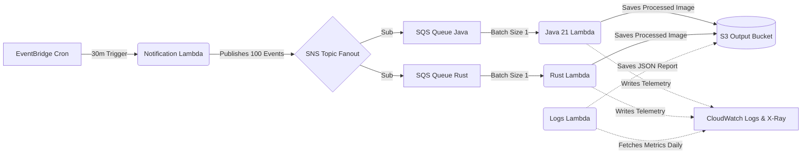
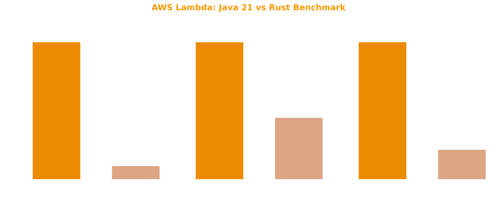

# Serverless Image Processing Benchmark

FinOps is no longer just about cost monitoring; it is about architectural efficiency. While AWS Lambda provides a highly scalable serverless execution model, the choice of runtime language introduces significant, often hidden, financial and performance trade-offs at scale.

Traditional enterprise languages like Java rely on heavy JVMs, leading to severe cold starts and inflated memory billing. In contrast, systems languages like Rust promise bare-metal performance with a minimal footprint. This benchmark exposes the exact infrastructure, latency, and cost multipliers when running an event-driven architecture (SQS & Lambda) using Java 21 versus Rust.

## TL;DR

Rust completely outperformed Java across all metrics in this sustained high-concurrency benchmark (~1,000+ invocations per function).

- **Cold Starts:** Rust is 10x faster (175ms average vs. Java's 1,814ms).
- **Memory Footprint:** Both functions were allocated an identical 512MB. Rust consumed only ~43MB of that budget versus Java's ~199MB — a 78% reduction driven purely by runtime efficiency, not configuration.
- **Performance & Tail Latency:** Rust is consistently faster. Its median execution (p50) is twice as fast (254ms vs. 497ms), but the real difference is at scale — Java's p99 latency spikes to over 8 seconds, while Rust stays under 3.7 seconds even at extreme percentiles.
- **Billing:** Rust generated 73% less total billed duration (399k ms vs. 1.49M ms).

## Architecture and Flow

The benchmark simulates a real-world, event-driven image processing pipeline. To ensure absolute fairness, the architecture employs a Fanout pattern, guaranteeing both languages receive the exact same workload at the exact same millisecond.



### The Workload

- **Trigger:** Batches of 100 image processing events are dispatched to the Lambda functions every 30 minutes. This interval intentionally forces periodic environment destruction, ensuring a reliable cold start measurement alongside concurrent warm executions.
- **Processing:** Upon invocation, the functions execute CPU-intensive tasks to download the image, apply a 70% compression algorithm, and upload the result back to S3.

<br>
<p align="center">
  <b>Original Image (800x600)</b><br>
  
</p>
<p align="center">
  
  
  <br>
  <i>Left: Java 21 Output (70%) &nbsp;&nbsp; | &nbsp;&nbsp; Right: Rust Output (70%)</i>
</p>

> **Note:** See the [Full Image Gallery](images/GALLERY.md) for a side-by-side visual comparison of all 100 processed samples, proving deterministic execution across both runtimes.

<br>

## Detailed Results

<br>
<p align="center">
  
</p>
<br>

### 1. Cold Starts (Init Duration)

| Metric | Java 21 | Rust |
|--------|---------|------|
| **Cold Start Count** | 116 (11.3%) | 96 (9.4%) |
| **Average** | 1814.78 ms | 175.26 ms |
| **p50 (Median)** | 1770.93 ms | 171.88 ms |
| **p90** | 2065.62 ms | 198.07 ms |
| **p99** | 2368.75 ms | 253.64 ms |
| **Maximum** | 2395.67 ms | 253.64 ms |

### 2. Warm Starts (Total Execution Duration)

| Metric | Java 21 | Rust |
|--------|---------|------|
| **Average** | 1248.19 ms | 370.44 ms |
| **p50 (Median)** | 497.15 ms | 254.23 ms |
| **p90** | 4618.30 ms | 605.34 ms |
| **p99** | 8229.60 ms | 3691.89 ms |
| **Maximum** | 15955.58 ms | 6766.31 ms |

### 3. Memory Usage (Peak)

| Metric | Java 21 | Rust |
|--------|---------|------|
| **Average** | ~198.39 MB | ~43.79 MB |
| **Maximum** | ~209.00 MB | ~45.00 MB |

*Both functions were allocated 512MB. Rust naturally consumed ~4.5x less memory — a direct reduction in GB-second billing with zero tuning required.*

### 4. Cost Projection

Based on AWS Lambda pricing (`us-east-1`, x86_64: $0.0000166667 per GB-second) and the observed billed duration delta from this benchmark, the following table projects monthly cost at scale. Memory is normalized to the 512MB allocation used for both functions.

| Monthly Invocations | Java 21 Est. Cost | Rust Est. Cost | Monthly Savings |
|---------------------|-------------------|----------------|-----------------|
| 100,000 | ~$0.71 | ~$0.19 | ~$0.52 |
| 1,000,000 | ~$7.10 | ~$1.90 | ~$5.20 |
| 10,000,000 | ~$71.00 | ~$19.00 | ~$52.00 |
| 100,000,000 | ~$710.00 | ~$190.00 | ~$520.00 |

## Environment & Methodology

Both functions were subjected to the exact same AWS environment constraints and IaC configurations:

- **Region:** `us-east-1`
- **Architecture:** `x86_64`
- **Allocated Memory:** 512 MB per function — identical for both. Memory consumption differences reflect runtime behavior, not configuration.
- **Concurrency Limit:** Unreserved (-1) to allow free horizontal scaling.
- **Event Source Mapping:** SQS Batch Size set to `1` to force maximum concurrency.
- **Runtimes:** Java 21 (Managed Runtime) vs. Rust (Edition 2021 on `provided.al2023` Custom Runtime).
- **SnapStart:** Explicitly disabled for Java.

## Code Complexity Trade-off

Rust's performance advantages come with real engineering costs. This section gives an honest picture of both sides.

### Dependency & Build Footprint

| Aspect | Java 21 | Rust |
|--------|---------|------|
| **Build Tool** | Maven (`pom.xml`) | Cargo (`Cargo.toml`) |
| **Runtime** | Managed (AWS-provided JRE) | Custom (`provided.al2023` + bootstrap binary) |
| **Deployment Package** | Fat JAR via `maven-shade-plugin` | Cross-compiled binary via `cargo lambda build --release` |
| **Cross-compilation** | Not required | Required (`cargo lambda` or Docker with `cross`) |
| **Compile Time (approx.)** | ~10–20s (incremental) | ~45–90s (full release build) |

### Handler Comparison

#### Java 21 Handler
*(Full implementation available in [src/java_processor/src/main/java/java_processor/Main.java](src/java_processor/src/main/java/java_processor/Main.java))*

```java
public Void handleRequest(SQSEvent event, Context context) {
    for (SQSEvent.SQSMessage message : event.getRecords()) {
        String filename = message.getBody();
        Segment segment = AWSXRay.beginSegment("java_function");
        
        try {
            // ... [S3 Download & Object mapping omitted for brevity] ...
            BufferedImage original = ImageIO.read(new java.io.ByteArrayInputStream(imageBytes));
            BufferedImage compressed = compress(original, 0.7f);
            // ... [S3 Upload omitted] ...
        } catch (Exception e) {
            segment.addException(e);
            throw new RuntimeException(e);
        } finally {
            AWSXRay.endSegment();
        }
    }
    return null;
}
```

#### Rust Handler
*(Full implementation available in [src/rust_processor/src/main.rs](src/rust_processor/src/main.rs))*

```rust
async fn handler(event: LambdaEvent<SqsEvent>, s3: S3Client, xray: XRayClient) -> Result<(), Error> {
    for record in event.payload.records {
        let filename = record.body.unwrap_or_default();
        
        // ... [S3 Download omitted for brevity] ...
        // Strict error handling and memory safety enforced at compile time
        let compressed = compress(image::load_from_memory(&image_data)?, 0.7);
        // ... [S3 Upload & Custom XRay segment push omitted] ...
    }
    Ok(())
}
```

## Limitations & Scope

- **Workload type:** This benchmark is CPU-bound (image compression).
- **JVM warmup:** The 30-minute cycle destroys Lambda environments before the JVM can reach sustained peak optimization.
- **SnapStart excluded by design:** Reflects the default production experience without deployment-time optimizations.
- **Single image size/type:** Benchmark used 800×600 JPEG inputs.

## Product Structure

```text
runtime_benchmark_lambda/
├── terraform/               # IaC — deploys all AWS resources
├── src/
│   ├── java_processor/      # Java 21 Lambda handler
│   └── rust_processor/      # Rust Lambda handler
├── images/
│   ├── original_images/     # Source images used in benchmark
│   └── processed_images/    # Output from both runtimes
├── reports/                 # Daily JSON reports exported from S3
│
└── scripts/                 # Notification, Logs lambda, and generators
```

## Reproducibility Guide (Tutorial)

To reproduce this benchmark in your own AWS account, follow this chronological pipeline.

### Prerequisites
Ensure your local environment has the following installed:
- **AWS CLI:** Authenticated with permissions.
- **Terraform:** For infrastructure deployment.
- **Python 3.7+:** To run the dataset generator.
- **Java 21 & Maven:** To compile the Java Lambda.
- **Rust & Cargo:** To cross-compile the Rust binary.

### Step 1: Generate the Test Dataset
The benchmark requires 100 deterministic images. Install the required HTTP library and run the fetcher:

```bash
pip install aiohttp
python scripts/fetch_images.py
```
> *Images are saved to `images/original_images/`.*

### Step 2: Build & Deploy
Two deployment scripts are provided to package the Lambdas and execute Terraform. Choose the one for your OS.

```bash
# Linux / macOS
./deploy.sh

# Windows (or any OS with Python 3)
python deploy.py
```

*(Note: The script runs `terraform plan`. Once verified, run `terraform apply` manually to provision resources).*

### Step 3: Trigger the Benchmark
Either wait for the EventBridge cron schedule (every 30 mins) or manually invoke the **Notification Lambda** via the AWS Console to dispatch the 100 events immediately.

### Step 4: Export Telemetry
Consolidate X-Ray and CloudWatch data into a JSON report:

```bash
# Force log consolidation
aws lambda invoke --function-name logs_lambda --payload '{}' response.json \
  --region us-east-1 --cli-binary-format raw-in-base64-out

# Download the reports
aws s3 sync s3://<YOUR_OUTPUT_BUCKET_NAME>/ reports/ \
  --exclude "*" --include "*daily_report.json" \
  --region us-east-1
```

### Step 5: Generate Charts (Optional)
To regenerate the performance visualization charts locally from your own benchmark data:

```bash
pip install matplotlib numpy
python scripts/generate_charts.py
```