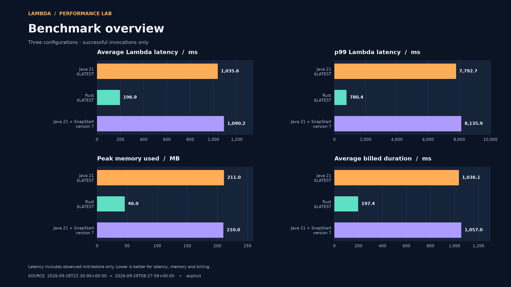
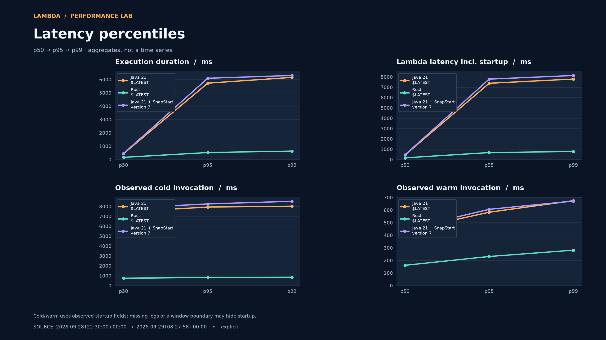
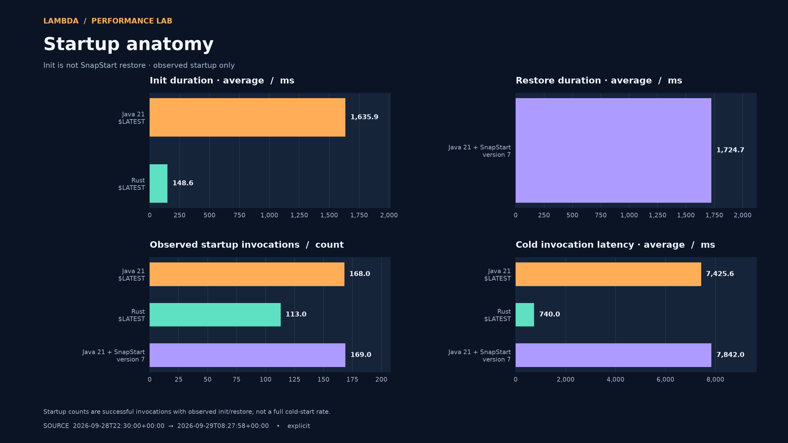
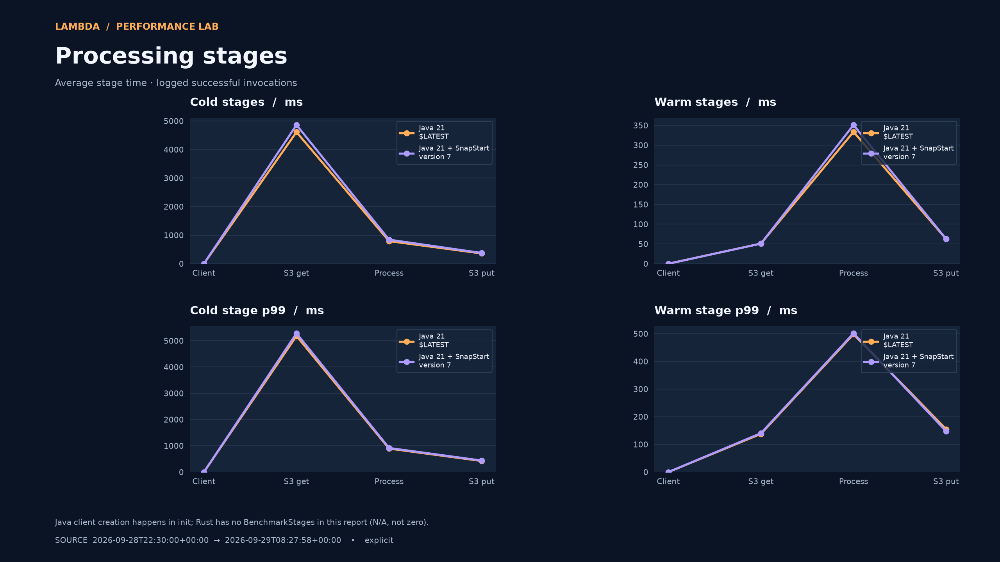
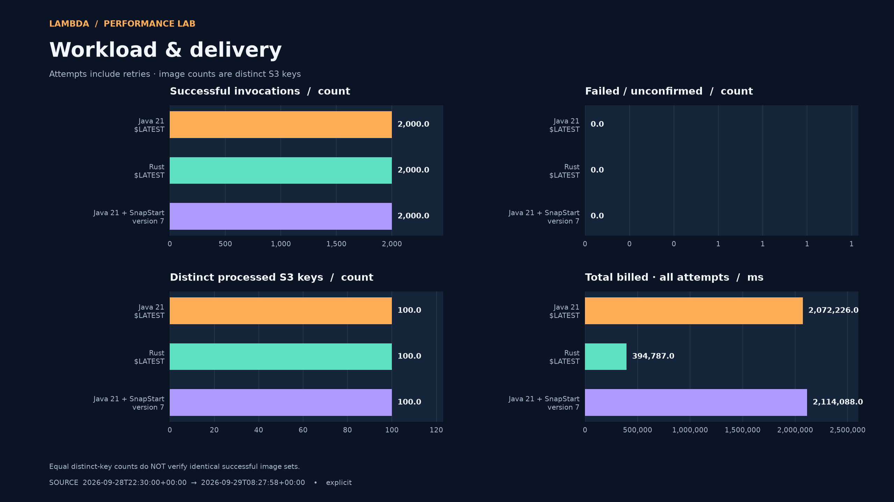
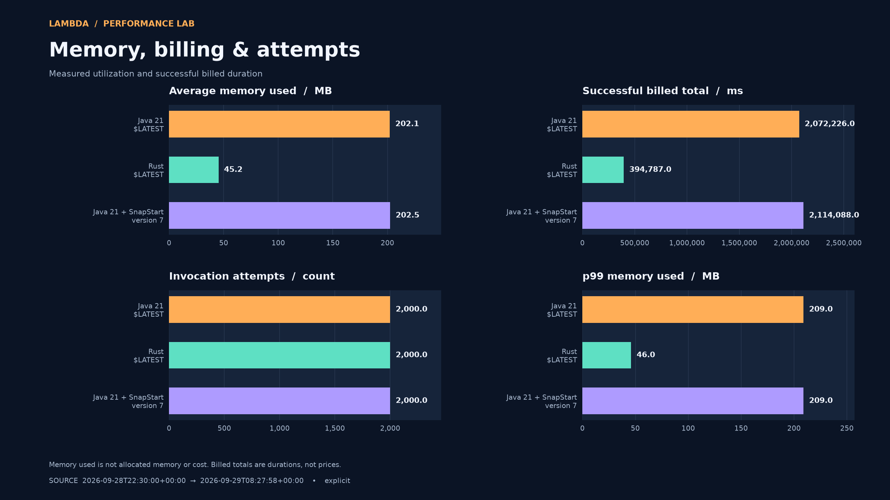

# Serverless Image Processing Benchmark

**Java 21 vs. Rust vs. Java 21 with SnapStart**, processing images through the same SNS → SQS → AWS Lambda architecture. This is a measured comparison of *these implementations in this run*, not a universal ranking of runtimes or an AWS pricing study.

> **Report:** [2026-09-29 daily report](reports/20260929T082758Z_daily_report.json) · Window: **2026-09-28 22:30 to 2026-09-29 08:27:58 UTC** · 2,000 observed attempts per configuration, 2,000 successful invocations each, 100 distinct processed S3 keys each. The report contains aggregate statistics, not individual invocation records.

## At a glance

| Metric | Java 21 (`$LATEST`) | Rust (`$LATEST`) | Java 21 + SnapStart (version `7`) |
|:--|--:|--:|--:|
| Avg Lambda latency incl. observed startup | 1,035.61 ms | **196.91 ms** | 1,090.21 ms |
| p99 Lambda latency incl. observed startup | 7,792.73 ms | **780.44 ms** | 8,135.91 ms |
| Avg observed cold-invocation latency | 7,425.57 ms | **740.03 ms** | 7,842.01 ms |
| Avg observed warm-invocation latency | 449.63 ms | **164.39 ms** | 467.03 ms |
| Avg memory **used** (not allocated) | 202.13 MB | **45.25 MB** | 202.49 MB |
| Avg billed duration, successful only | 1,036.11 ms | **197.39 ms** | 1,057.04 ms |

Rust had approximately **5.3× lower average startup-inclusive Lambda latency** and **10× lower p99** than ordinary Java in this window. The SnapStart configuration did **not** improve Java's observed latency here: average startup-inclusive latency was **5.3% higher** than ordinary Java's. These are descriptive results, not proof that SnapStart generally makes Java slower.



## Architecture and workload


> **About X-Ray in the diagram:** The architecture includes X-Ray because tracing is configured for the processors, but it was **not used for the results shown here**. The analyzer found **zero matching X-Ray traces** for all three functions in this report's time window, so there were no trace-based phase timings or error rates to compare. The dashboards instead use CloudWatch log metrics. The report does not establish why no traces matched; zero matching traces should not be read as zero errors or as proof that tracing was disabled.

1. The producer lists the **100 objects** in the input S3 bucket and publishes each key to an SNS topic. EventBridge schedules this every 30 minutes (UTC); the producer also rejects an input bucket that does not contain exactly 100 objects.
2. SNS fans out to **three separate SQS queues**, one for each configuration. SQS event source mappings use batch size `1` and maximum concurrency `100` per mapping. Queue delivery and retries are asynchronous; messages are *not* guaranteed to begin processing at the same millisecond.
3. Each handler downloads an image, decodes it, resizes it to **70% of the original width and height** (e.g. 800×600 → 560×420) with bilinear-family interpolation, JPEG-encodes at **quality 75**, and uploads to its own output key prefix.
4. The analyzer groups CloudWatch log records by function and **published version**, counts observed successful writes, and aggregates log timings. The results and charts here use those log-derived metrics.

All three Lambda functions have **512 MB allocated memory** and a 30-second timeout in Terraform. Java and Rust use `$LATEST`; the SnapStart function publishes a version and its SQS mapping targets the **qualified version ARN** (version `7` in this report). Ordinary Java does not enable SnapStart. See [Terraform compute](terraform/compute.tf), [event sources](terraform/monitoring.tf), [fanout](terraform/messaging.tf), and the [analyzer](scripts/analyzer.py).

### Same intent, not identical execution

The workload is **mostly similar, but the processes may differ**. The three handlers aim for the same input keys, dimensions, interpolation family, JPEG quality and 4:2:0 subsampling. But Java uses `ImageIO`/`Graphics2D`, while Rust uses the `image` and `jpeg-encoder` crates; their decoders, resamplers, encoders, thread behavior and S3 SDKs need not perform identical work or produce byte-identical JPEGs. The ordinary Java handler creates its S3 client during initialization; the SnapStart variant recreates it after restore; Rust creates its S3 client at runtime startup. That is part of the measured implementation, not a controlled single-variable runtime experiment.

The report confirms **100 distinct processed keys per configuration**, but does not include the actual successful key sets. Equal counts cannot establish identical sets or an end-to-end delivery guarantee. Retries are included in attempt counts; do not treat the three rows as paired per-image samples. A [visual gallery of output examples](images/GALLERY.md) is available, but visual similarity is not a pixel/byte-level equivalence test.

<p align="center">
  
  
  
  
</p>
<p align="center"><em>Original · Java 21 · Rust · Java 21 + SnapStart (image 10)</em></p>

## Dashboard gallery and measured results

Every dashboard below is generated from the [same checked-in report](reports/20260929T082758Z_daily_report.json). The charts show **aggregates**, not time series or raw latency distributions. The [dashboard script](scripts/dashboard.py) checks report structure, numeric ranges and count consistency before rendering; it cannot verify information the report does not contain.

### Latency: duration vs. startup-inclusive time



| Metric (ms; successful invocations) | Java 21 | Rust | Java + SnapStart |
|:--|--:|--:|--:|
| Execution duration avg | 898.19 | 188.51 | 944.48 |
| Execution duration p50 / p99 | 441.91 / 6,158.17 | 165.00 / 634.05 | 454.05 / 6,300.40 |
| Lambda latency incl. observed startup avg | 1,035.61 | 196.91 | 1,090.21 |
| Lambda latency incl. observed startup p50 / p99 | 441.91 / 7,792.73 | 165.00 / 780.44 | 454.05 / 8,135.91 |
| Observed warm invocation avg / p99 | 449.63 / 674.54 | 164.39 / 281.42 | 467.03 / 671.38 |
| Observed cold invocation avg / p99 | 7,425.57 / 8,029.36 | 740.03 / 845.69 | 7,842.01 / 8,524.74 |

**Definitions:** execution duration is the Lambda `Duration` for successful invocations. Startup-inclusive latency adds **observed** Init Duration or Restore Duration to Duration where the logs provide it. It **excludes SQS queue wait and SNS delivery**. Cold/warm classification is based on observed startup fields, not a guarantee that every actual startup was captured. The `p99` of a combined distribution cannot be reconstructed by summing separate p99 values.

### Startup: why SnapStart was a surprise



While writing the first version of this project, I came across **Lambda SnapStart** and thought it was a natural fit for the Java cold-start problem. Or so I thought: **in this run, it was worse** than regular Java on the measures that matter to an invocation.

| Observed startup metric | Java 21 | Rust | Java + SnapStart |
|:--|--:|--:|--:|
| Invocations with observed startup / 2,000 successful | 168 (8.4%) | 113 (5.7%) | 169 (8.45%) |
| Init Duration avg | 1,635.91 ms | 148.61 ms | N/A |
| Restore Duration avg | N/A | N/A | 1,724.68 ms |
| Cold invocation latency avg | 7,425.57 ms | 740.03 ms | 7,842.01 ms |
| Cold invocation latency p99 | 8,029.36 ms | 845.69 ms | 8,524.74 ms |

**Init and restore are different measurements:** SnapStart restore is not ordinary Java initialization. Among successful invocations with observed startup, SnapStart's **full cold invocation** averaged about **416 ms longer** than ordinary Java's. Its overall average Lambda latency was about **55 ms higher** (1,090.21 vs. 1,035.61 ms), its p99 about **343 ms higher**, and its successful billed-duration total **2.0% higher**. The cold cohorts are different observations, not matched pairs. The logs alone cannot attribute the difference to SnapStart itself: post-restore client setup, S3/network variability, concurrency, and different execution paths may all matter. This result is a reason to benchmark the **whole request path** in your own workload, not a claim that SnapStart is universally slower.

### Where the Java time went



| Average logged stage (ms) | Java cold | Java warm | SnapStart cold | SnapStart warm |
|:--|--:|--:|--:|--:|
| S3 client | 0.00 | 0.00 | 0.00 | 0.00 |
| S3 get | 4,612.09 | 51.07 | 4,862.16 | 50.86 |
| Image processing | 792.11 | 333.63 | 843.50 | 351.13 |
| S3 put | 359.51 | 62.58 | 376.21 | 62.70 |

The logged **cold S3 get** stage dominates the Java cold-path stage averages. `client_ms=0` for ordinary Java because its client is created during init, outside these per-invocation stages; SnapStart's near-zero logged value does not imply that restoring or rebuilding the client is free. These are per-stage aggregates of *available stage logs*, not a decomposition that can be summed into the reported average invocation latency. **Rust does not emit `BenchmarkStages` in this report**; its stage data is unavailable, not zero.

### Delivery, memory and billing





| Metric | Java 21 | Rust | Java + SnapStart |
|:--|--:|--:|--:|
| Attempts / successful / failed or unconfirmed | 2,000 / 2,000 / 0 | 2,000 / 2,000 / 0 | 2,000 / 2,000 / 0 |
| Unique processed S3 keys | 100 | 100 | 100 |
| Memory used avg / p99 / peak | 202.13 / 209 / 211 MB | 45.25 / 46 / 46 MB | 202.49 / 209 / 210 MB |
| Billed duration avg, successful only | 1,036.11 ms | 197.39 ms | 1,057.04 ms |
| Billed duration total, all attempts | 2,072,226 ms | 394,787 ms | 2,114,088 ms |

**Billing is based on allocated memory (512 MB), not on observed memory used.** Lower used memory does not itself reduce Lambda GB-second charges at the same allocation. The billed-duration totals are measured runtime inputs, **not dollar costs**; a real cost estimate also needs applicable regional rates, request charges, free tiers and any SnapStart-related charges. Failure counts above come from the analyzer's observed log-based classification.

## Methodology and limitations

- **Window and versions matter.** The report spans nearly ten hours; Java/Rust use `$LATEST`, while SnapStart uses published version `7`. Do not merge metrics across versions or compare to the previous README's older run.
- **Successful-only metrics.** Duration, startup-inclusive latency, billed averages, stage timings and memory summaries exclude failed or unconfirmed invocations; `billed_ms_all_attempts_total` includes all logged attempts. An S3 `Processed:` log line and no detected failure mark success in the analyzer; this does not prove end-to-end delivery.
- **Startup observation is incomplete by design.** Cold/warm labels depend on visible init/restore fields. Missing log events and window boundaries can hide startup. Repeated 30-minute dispatches may encourage cold starts but do not guarantee environment recycling.
- **Comparable inputs are not identical compute.** Library implementations, S3 access, async vs. sync SDKs and SnapStart restore hooks differ; this is a full-handler comparison, not an isolated CPU or runtime microbenchmark. The input set contains 800×600 JPEGs; results may differ for other sizes, formats and traffic patterns.

## Repository layout

```text
terraform/                   AWS fanout, queues, Lambdas and schedules
src/java_processor/          Java 21 handler (no SnapStart)
src/java_processor_snapstart/ Java 21 handler with SnapStart restore hook
src/rust_processor/          Rust handler
scripts/producer.py          Publishes input keys to SNS
scripts/analyzer.py          Generates version-split daily JSON reports
scripts/dashboard.py         Validates reports and renders six PNGs
reports/                     Example analyzer output
images/                      Architecture, dashboards and image examples
```

The Java handlers use Maven and a managed runtime; Rust uses Cargo and `provided.al2023`. See the [ordinary Java](src/java_processor/src/main/java/java_processor/Main.java), [SnapStart Java](src/java_processor_snapstart/src/main/java/java_processor_snapstart/Main.java), and [Rust](src/rust_processor/src/main.rs) implementations for actual handler logic and dependency choices rather than simplified pseudocode.

## Reproduce the charts

You can render the checked-in report **without AWS credentials**:

```bash
python -m pip install matplotlib
python scripts/dashboard.py --report reports/20260929T082758Z_daily_report.json
python -m unittest scripts.test_dashboard
```

The command validates the report and writes `images/benchmark_{overview,latency,startup,stages,workload,resources}.png`. Omit `--report` to use the latest filename matching `reports/*_daily_report.json`, or use `--output-dir` to save PNGs elsewhere. Missing Rust stage timings remain unavailable instead of being silently plotted as zero.

## Reproduce the AWS workload

**Prerequisites:** AWS CLI credentials, Terraform, Python, `zip`, Java 21/Maven, Rust/Cargo and the cross-compilation toolchain used by [the Rust Makefile](src/rust_processor/Makefile). Running the workload provisions resources and incurs AWS charges.

1. Download the 100 seeded input images, then upload them to your input bucket when it exists:

   ```bash
   python -m pip install aiohttp
   python scripts/fetch_images.py
   ```

2. Build the three processors and supporting Lambdas with `./deploy.sh` (Linux/macOS) or `python deploy.py`. Both prompt for bucket names and run **`terraform plan` only**. Review the plan and run `terraform apply` yourself in `terraform/` with the same bucket variables. The input bucket must contain exactly 100 objects before running the producer; for example:

   ```bash
   aws s3 sync images/original_images/ s3://<INPUT_BUCKET>/ --region us-east-1
   ```

3. Allow the EventBridge producer schedule to run (every 30 minutes UTC), or invoke `noti_lambda` manually. The analyzer's default scheduled window is the last 24 hours; for a controlled comparison, invoke `logs_lambda` with an explicit UTC `start` and `end` **after** the test ends:

   ```bash
   aws lambda invoke --function-name logs_lambda \
     --payload '{"start":"2026-09-28T22:30:00+00:00","end":"2026-09-29T08:27:58+00:00"}' \
     --cli-binary-format raw-in-base64-out --region us-east-1 response.json
   aws s3 sync s3://<LOGS_BUCKET>/reports/ reports/ \
     --exclude '*' --include '*_daily_report.json' --region us-east-1
   python scripts/dashboard.py
   ```

   Replace the example timestamps with **your own** completed test window. Verify the same successful S3 key set for all three functions independently before treating the runtime comparison as controlled.
